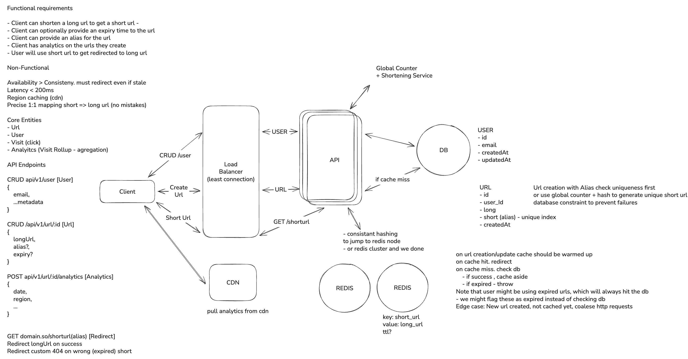

# UrlShortner

a fast URL shortener with analytics, multi-instance API, and production-ready ops.

# High level design

# Approach

- Keep the API stateless so it can scale horizontally.
- Cache hot reads (short code lookups) in Redis with smart TTL.
- Record visits asynchronously to keep redirects fast.
- Validate and normalize URLs at the edge for safety and consistency.
- Health checks + structured logs for reliable multi-instance ops.

# Tech Stack

- .NET 10 API (Controllers + Services)
- PostgreSQL (EF Core)
- Redis (cache + rate limiting)
- React + Vite + Tailwind
- Railway deployment

# Infra choices

- Railway for fast deploys, managed Postgres/Redis, and multi-instance scaling.
- Postgres as the single source of truth for URLs and analytics.
- Redis for cache-aside lookups and distributed rate limiting.
- Two API replicas behind a load balancer with readiness checks.
- Two Redis instances planned with consistent hashing (next milestone).

# Scale

Target: 100k RPS with horizontal scaling.

- Multi-instance API behind Railway load balancer.
- Shared Postgres + Redis to keep data consistent.
- Health checks: `/health`, `/health/live`, `/health/ready`.
- Instance tracing via `X-Instance-Id` header in responses.
